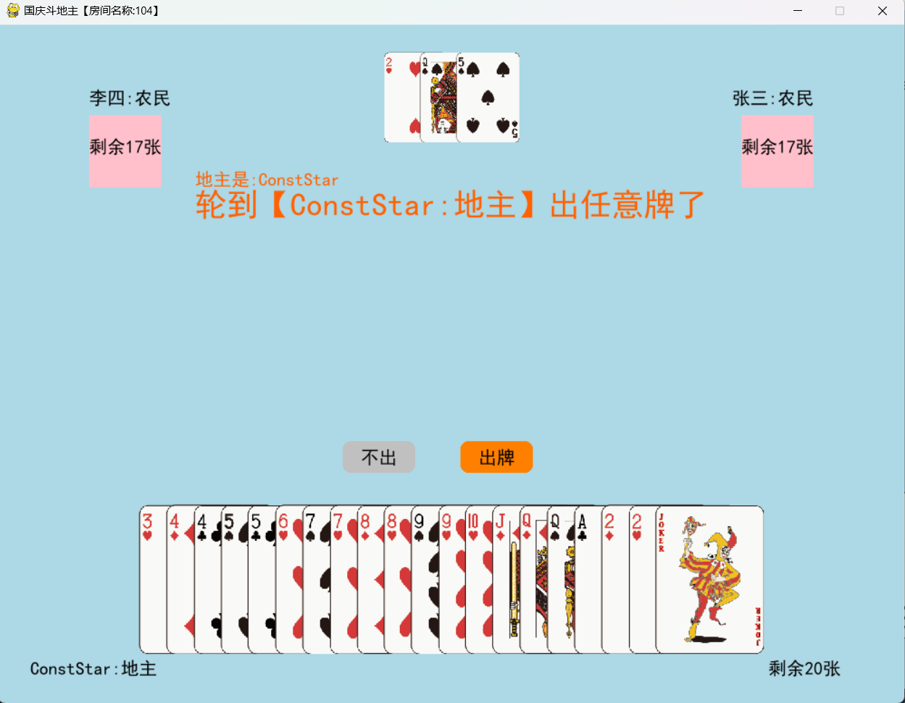

# 斗地主游戏

  

 

Python3+PyGame简单的多人联机斗地主游戏

### 目录结构

- docs 文档
  - images 文档图片
- resources 资源文件
  - cards 卡片
  - fonts 字体
- poker_client.py 客户端
- poker_server.py 服务器端
- requirements.txt 依赖

### Dependencies

- Python3.9+

### 试玩
[Releases](/releases)  

### 运行效果

